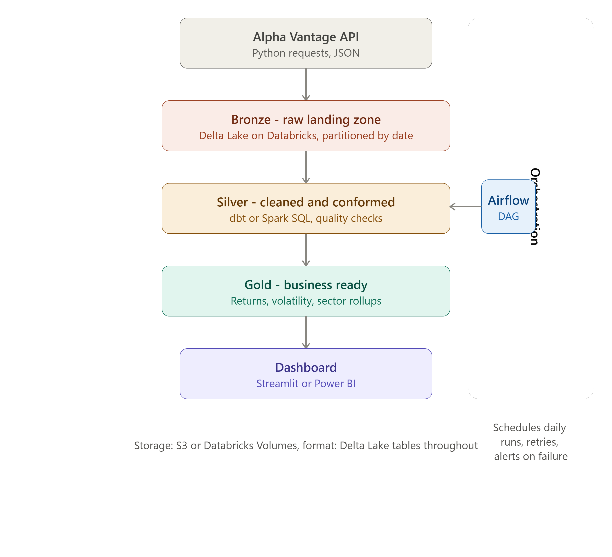
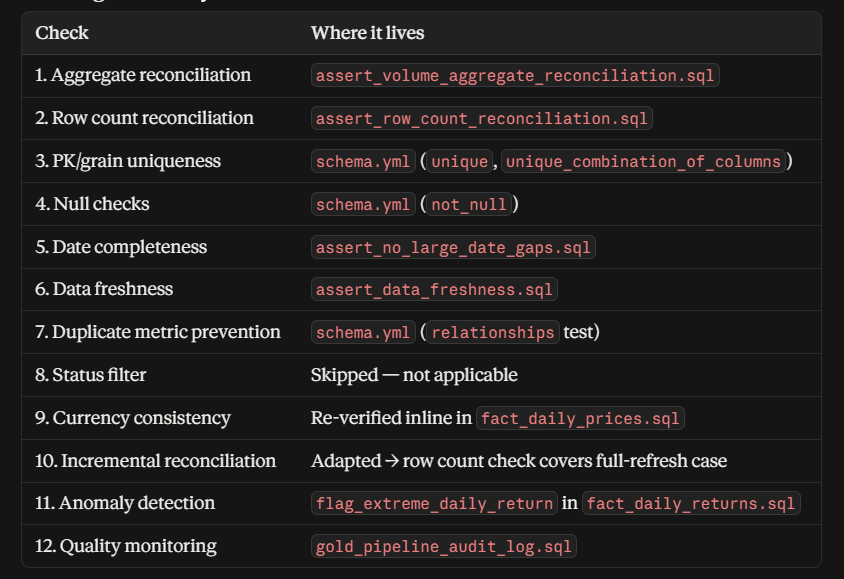
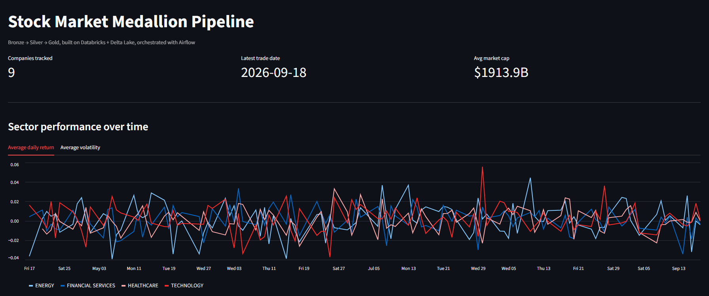
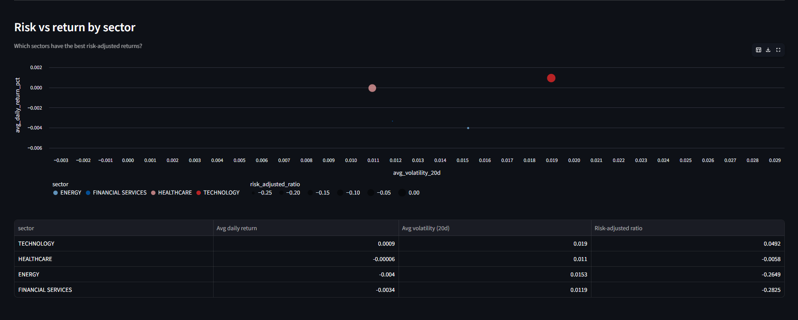
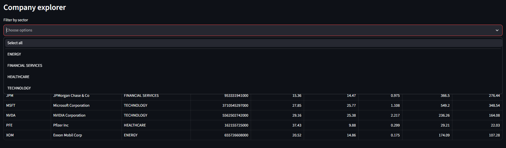
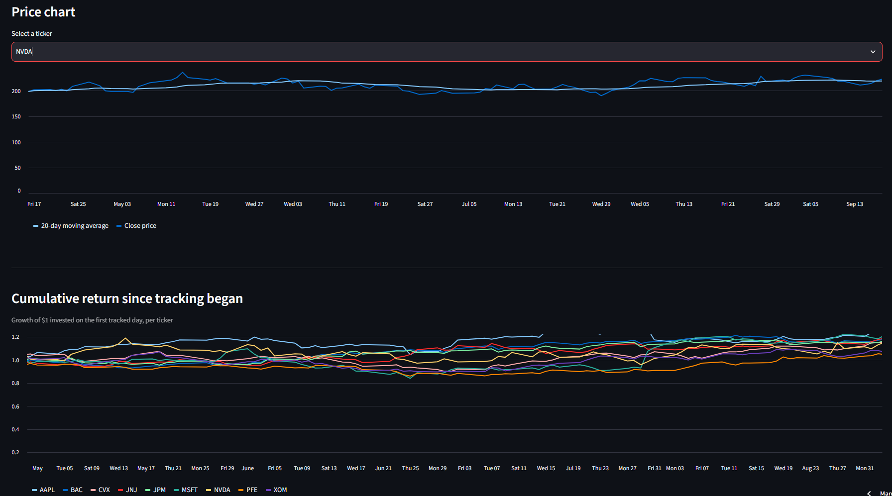
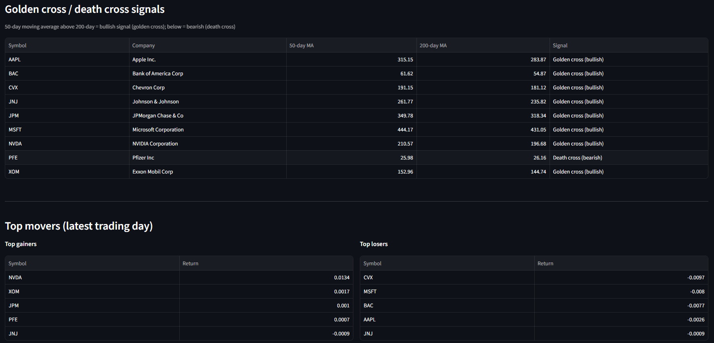
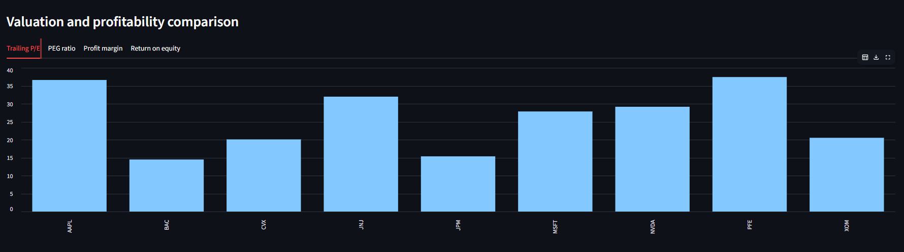
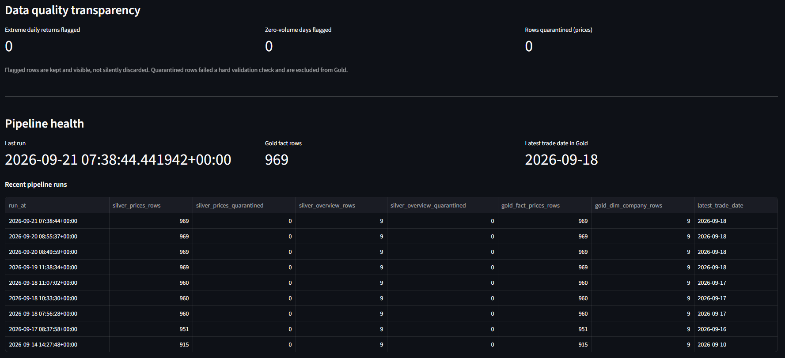

# 💰 Stock Finance Medallion Data Pipeline

An end-to-end, production-style data pipeline that ingests real daily stock market data, processes it through a Bronze → Silver → Gold medallion architecture on Databricks + Delta Lake, orchestrates it with Airflow, and serves it through a live analytics dashboard.


**🔗 Live dashboard:** [https://stockfinancemedallionpipeline-w7tmzgq5mbhugipcp3ywi7.streamlit.app](https://stockfinancemedallionpipeline-w7tmzgq5mbhugipcp3ywi7.streamlit.app/)
**📁 Repository:** this repo

---

## 📌 Project Overview

This project ingests daily OHLCV price data and company fundamentals for 9 stocks across 4 sectors (Technology, Finance, Energy, Healthcare) from the Alpha Vantage API, lands it raw in Databricks, transforms it through a two-stage quality-gated pipeline, and surfaces the result as a public, interactive Streamlit dashboard — all fully automated on a daily schedule via Airflow.

It's built to reflect how data actually moves through a real organization: messy at the source, cleaned deliberately, validated before it's trusted, and only then handed to the business.

## 🎯 Business Problem

**Which sectors offer the best risk-adjusted returns, and can that be answered from data that refreshes itself every day without manual intervention?**

Raw market data is noisy, inconsistently formatted, and comes with real-world constraints (API rate limits, missing fields, schema quirks). This project treats that as the actual problem to solve — not just fetching prices, but building a pipeline that can be trusted to catch its own mistakes.

## 🏗️ Architecture

```
Alpha Vantage API
        │
        ▼
┌───────────────────┐
│   BRONZE (raw)     │  Databricks Volumes → Delta tables (VARIANT JSON)
└───────────────────┘
        │
        ▼
┌───────────────────┐
│   SILVER (clean)   │  dbt: typed, deduplicated, flagged, quarantined
└───────────────────┘
        │
        ▼
┌───────────────────┐
│   GOLD (business)  │  Star schema: facts, dimension, sector rollups
└───────────────────┘
        │
        ▼
┌───────────────────┐      ┌──────────────────────┐
│  Streamlit          │◄────│  Airflow (Docker)     │
│  dashboard (public)  │      │  daily + weekly DAGs  │
└───────────────────┘      └──────────────────────┘
```


## 🔄 End-to-End Data Flow

1. **`fetch_prices.py`** calls Alpha Vantage's `TIME_SERIES_DAILY` for 9 tickers daily, lands raw JSON in a Databricks Volume, partitioned by ingestion date.
2. **`fetch_company_overview.py`** calls `OVERVIEW` for fundamentals (sector, market cap, 29 metrics), run weekly rather than daily since fundamentals barely change.
3. **`refresh_bronze_tables.py`** rebuilds the Bronze Delta tables from whatever raw JSON currently sits in the Volume, using a single `VARIANT` column to stay resilient to schema drift.
4. **dbt Silver models** explode the nested JSON, cast types, deduplicate, and run every row through a set of hard/soft data quality checks — hard failures are quarantined, soft flags are kept and surfaced.
5. **dbt Gold models** build a star schema (`dim_company`, `fact_daily_prices`, `fact_daily_returns`, `agg_sector_rollup`) plus an incremental audit log tracking every pipeline run.
6. **Airflow**, running in Docker, chains all of the above into one daily DAG with strict task dependencies — Gold never builds on top of untested Silver data.
7. **Streamlit** reads exclusively from Gold and renders 11 live sections, deployed publicly via Streamlit Community Cloud.

## 🛠️ Technology Stack

| Layer | Technology |
|---|---|
| Ingestion | Python, `requests`, `databricks-sdk` |
| Storage / processing | Databricks (Free Edition), Delta Lake, Unity Catalog Volumes |
| Transformation | dbt (`dbt-databricks`), Spark SQL |
| Orchestration | Apache Airflow 3.3, Docker Compose |
| Dashboard | Streamlit, `databricks-sql-connector`, pandas |
| Data source | Alpha Vantage API (free tier) |

## 📂 Repository Structure

```
finance-medallion-pipeline/
│
├── .env                              # Real secrets (gitignored, never committed)
├── .env.example                      # Template showing required variables
├── .gitignore                        # Excludes secrets, venv, and generated files
├── README.md                         # Project overview, architecture, setup guide
├── requirements.txt                  # Python dependencies for ingestion/dbt/dashboard
├── .devcontainer/devcontainer.json   # GitHub Codespaces config (auto-added by GitHub)
│
├── ingestion/                        # BRONZE — raw API ingestion
│   ├── fetch_prices.py                 # Pulls daily OHLCV from Alpha Vantage, idempotent
│   ├── fetch_company_overview.py       # Pulls fundamentals (weekly, not daily)
│   └── refresh_bronze_tables.py        # Rebuilds Bronze Delta tables from raw JSON
│
├── dbt_project/                      # SILVER + GOLD — all transformation logic
│   ├── dbt_project.yml                 # Project config, schema/materialization rules
│   ├── packages.yml                    # dbt_utils dependency
│   ├── models/
│   │   ├── sources.yml                   # Declares Bronze tables as dbt sources
│   │   ├── silver/
│   │   │   ├── int_company_overview_flagged.sql  # Types + flags fundamentals
│   │   │   ├── silver_company_overview.sql        # Clean fundamentals output
│   │   │   ├── silver_company_overview_quarantine.sql  # Rejected fundamentals rows
│   │   │   ├── int_daily_prices_flagged.sql       # Explodes, types, flags prices
│   │   │   ├── silver_daily_prices.sql            # Clean daily prices output
│   │   │   ├── silver_daily_prices_quarantine.sql # Rejected price rows
│   │   │   └── schema.yml                         # Silver tests + model contract
│   │   └── gold/
│   │       ├── dim_company.sql                    # Star schema dimension
│   │       ├── fact_daily_prices.sql               # Fact table, symbol + trade_date grain
│   │       ├── fact_daily_returns.sql              # Returns, moving avg, volatility, anomaly flag
│   │       ├── agg_sector_rollup.sql               # Sector-level daily rollup
│   │       ├── gold_pipeline_audit_log.sql         # Incremental run-history log
│   │       └── schema.yml                          # Gold tests, relationships
│   └── tests/                          # Singular reconciliation/freshness tests
│       ├── assert_row_count_reconciliation.sql
│       ├── assert_volume_aggregate_reconciliation.sql
│       ├── assert_data_freshness.sql
│       └── assert_no_large_date_gaps.sql
│
├── airflow_docker/                   # ORCHESTRATION — Airflow via Docker
│   ├── docker-compose.yaml             # Airflow's official multi-container setup
│   ├── Dockerfile                      # Extends Airflow image with project packages
│   ├── .env                            # AIRFLOW_UID only, not sensitive
│   └── dags/
│       ├── stock_pipeline_dag.py         # Daily DAG: fetch → refresh → silver → gold
│       ├── overview_refresh_dag.py       # Weekly DAG: fundamentals refresh
│       └── utils/
│           └── alerts.py                   # Slack failure notification callback
│
├── dashboard/                        # PRESENTATION — Streamlit app
│   ├── app.py                          # Orchestrator, sequences all sections
│   ├── db.py                           # Databricks connection + query caching
│   └── sections/                       # One module per dashboard section
│       ├── kpi_header.py
│       ├── sector_performance.py
│       ├── risk_vs_return.py
│       ├── company_explorer.py
│       ├── price_chart.py
│       ├── cumulative_returns.py
│       ├── golden_cross.py
│       ├── top_movers.py
│       ├── valuation_comparison.py
│       ├── data_quality_panel.py
│       └── pipeline_health.py
│
├── docs/                             # Architecture diagram, dashboard screenshots
│
└── tests/                            # Python-level unit tests (ingestion logic)
```

## 🥉 Bronze Layer

Raw, unmodified landing zone — exactly what the API returns, nothing more.

- **Idempotent writes**: re-running for the same date overwrites rather than duplicates.
- **Quota-safe**: detects Alpha Vantage's daily rate-limit response and stops the entire run immediately rather than burning further calls against an exhausted quota.
- **Targeted backfill/recovery**: a failed ticker on a given date can be re-fetched individually (`--date`, `--tickers` flags) without re-processing tickers that already succeeded.
- Stored as a single `VARIANT` column (`raw_json`) rather than an inferred fixed schema — Alpha Vantage's dynamic date-keyed JSON structure isn't compatible with normal schema inference, and this approach also means new fields added by the API in the future won't break ingestion.

## 🥈 Silver Layer

Cleaned, typed, conformed, and quality-gated.

- Explodes the nested `Time Series (Daily)` object into one row per `(symbol, trade_date)`.
- Handles a real Alpha Vantage quirk: missing fundamentals often arrive as the literal string `"None"` rather than a JSON null — normalized before casting.
- Every row is run through hard checks (missing required fields, impossible OHLC values, non-USD currency) and soft checks (zero volume, unexpected sector, negative P/E, stale fundamentals).
- **Hard failures → quarantine tables.** Soft flags → kept in the clean table, visible as flag columns, never silently dropped.

## 🥇 Gold Layer

Business-ready, star-schema modeled.

- `dim_company` — one row per symbol, 29 fundamentals fields.
- `fact_daily_prices` — one row per `(symbol, trade_date)`, joined to `dim_company`.
- `fact_daily_returns` — daily return %, 20-day moving average, 20-day volatility, extreme-move flagging.
- `agg_sector_rollup` — sector-level daily rollups, the table the dashboard's core business question is answered from.
- `gold_pipeline_audit_log` — incremental table, appends one row per pipeline run with row counts and freshness, across every layer.
  

## 🧹 Data Quality Framework

Adapted from a standard financial data quality checklist to fit stock market data specifically (several checklist items, like transaction-status or account-status validation, don't map to this domain and were deliberately skipped rather than force-fit):

| Check | Implementation |
|---|---|
| Schema validation | dbt model contracts — the run fails if actual output doesn't match declared types |
| Mandatory null checks | Hard failure → quarantine |
| Deduplication | By `(symbol, trade_date)` / `symbol` |
| Amount/price validation | OHLC consistency, non-negative volume, non-positive price checks |
| Date validation | No future-dated records; freshness within 7 days |
| Referential integrity | `relationships` test between fact and dimension tables |
| Currency consistency | Non-USD currency is a hard failure |
| Historical anomaly detection | Daily returns beyond ±20% flagged, not deleted |
| Aggregate & row-count reconciliation | Singular dbt tests comparing Silver vs Gold |
| Data quality monitoring | `gold_pipeline_audit_log`, surfaced live on the dashboard |

## ⚡ Incremental Processing

Bronze table refresh uses a **full-refresh (`CREATE OR REPLACE TABLE`)** pattern rather than Databricks' `COPY INTO` incremental load. This was a deliberate tradeoff: `COPY INTO` combined with `VARIANT` columns hit undocumented, inconsistent behavior in this environment after multiple isolated attempts — rather than ship a fragile incremental path, this project uses a simpler, fully reliable full-refresh, appropriate at this data volume (9 tickers, KBs per file). At production scale, this would be revisited.

Ingestion itself **is** incremental in the sense that matters most: `fetch_prices.py` checks whether a ticker/date combination is already fetched before calling the API again, avoiding redundant calls against a limited free-tier quota.

## 🧩 Data Model

Star schema — one fact grain per `(symbol, trade_date)`, radiating out to a single `dim_company` dimension. See `docs/architecture_diagram.png` for the full ERD.

## 🔗 dbt Lineage

Generate the interactive lineage graph locally:
```
cd dbt_project
dbt docs generate
dbt docs serve
```

## 📊 Analytics / Business Metrics

The dashboard (deployed live, link above) includes:
- Sector performance trends (return & volatility over time)
- Risk-adjusted return ranking by sector (a Sharpe-style ratio) — the direct answer to this project's business question
- Company explorer with valuation/profitability filters
- Price charts with 20-day moving average overlay
- Cumulative return chart (growth of $1 invested)
- Golden cross / death cross technical signals
- Top gainers/losers on the latest trading day
- Data quality transparency panel (flag & quarantine counts, live)
- Pipeline health panel (row counts, freshness, run history)

## 📸 Screenshots









## 🚀 How to Run

```bash
# 1. Clone and set up environment
git clone https://github.com/YOUR_USERNAME/finance-medallion-pipeline.git
cd finance-medallion-pipeline
python -m venv venv
venv\Scripts\activate   # Windows
pip install -r requirements.txt

# 2. Configure credentials
cp .env.example .env
# fill in your Alpha Vantage key + Databricks host/token/http_path

# 3. Run ingestion
python ingestion/fetch_prices.py
python ingestion/fetch_company_overview.py
python ingestion/refresh_bronze_tables.py

# 4. Build the pipeline
cd dbt_project
dbt deps
dbt run --select silver && dbt test --select silver
dbt run --select gold && dbt test --select gold

# 5. Run the dashboard
cd ../dashboard
streamlit run app.py

# 6. (Optional) Run the full pipeline on a schedule via Airflow
cd ../airflow_docker
docker compose up airflow-init
docker compose up -d
# open http://localhost:8080
```

## 🧪 Testing

- **24 dbt tests** across Silver (10) and Gold (14): `not_null`, `unique`, `unique_combination_of_columns`, `relationships`, plus 4 custom singular tests (row-count reconciliation, aggregate reconciliation, freshness, date-gap detection).
- **Model contracts** on key Gold/Silver models enforce exact column types at build time.
- Run everything: `dbt test` from `dbt_project/`.

## 📈 Pipeline Results

- 9 tickers, 4 sectors, ~100 days of rolling history per ticker (~900 Silver rows at steady state)
- Fully automated daily run: fetch → refresh → Silver → test → Gold → test, gated at every stage
- Zero manual intervention required once Airflow is running

## 🧠 Challenges & Solutions

- **Alpha Vantage's dynamic, date-keyed JSON** broke standard schema inference → solved with a single `VARIANT` column and explicit `variant_explode` flattening in Silver.
- **Backtick-escaped field names silently returned NULL** for keys containing periods (`"1. open"`) → root-caused via Databricks' own documentation, fixed with bracket-path syntax.
- **`COPY INTO` + VARIANT columns** produced silent zero-row results across multiple isolated attempts → pragmatically fell back to full-refresh rather than ship something unreliable (see Incremental Processing above).
- **A reconciliation test comparing Silver to Gold was failing on every scheduled run** — traced to the test running *before* Gold had rebuilt in the DAG's task order, not a data problem; fixed by tagging the test and excluding it from the Silver test stage.
- **Alpha Vantage's daily quota** required a fail-fast pattern: the ingestion scripts detect a rate-limit response and stop immediately, logging exactly which tickers were skipped for later targeted recovery.

## 🎤 Data Engineering Concepts Demonstrated

Medallion architecture · idempotent ingestion · schema-agnostic raw landing (VARIANT) · data quality gates & quarantine pattern · star schema dimensional modeling · dbt model contracts · orchestration with task-level dependency gating · containerized orchestration (Docker) · observability via an audit log · secrets management across local and cloud environments.

## 🔮 Future Improvements

- Resolve `COPY INTO` + VARIANT limitation for true incremental Bronze loads
- Slack/email failure alerts (hook already built, needs a webhook configured)
- Expand beyond 9 tickers with a paid Alpha Vantage tier
- CI/CD (GitHub Actions) running `dbt test` on every pull request
- Historical backfill beyond the 100-day compact window but with the paid version. But now it's a free version that I used.

## 👨‍💻 Author

**Shubham Tyagi**
[github](https://github.com/ShubhTyagi1616)
[linkedin](https://www.linkedin.com/in/shubham-tyagi-947b49400/)
[Stock_Finance_Medallion_Pipeline](https://stockfinancemedallionpipeline-w7tmzgq5mbhugipcp3ywi7.streamlit.app/)
